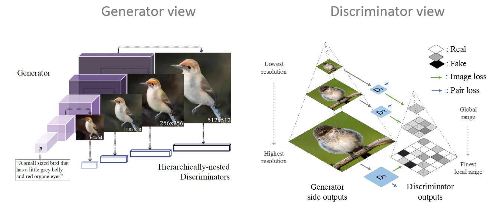
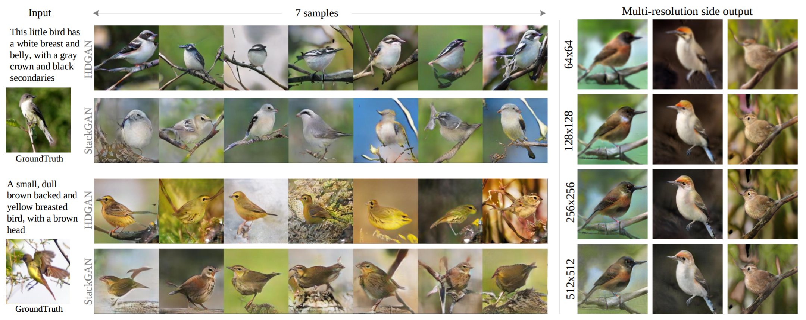

## Hierarchically-nested Adversarial Network (Pytorch implementation)
###### We call our method **HDGAN**, referring to **H**igh-**D**efinition results and the idea of **H**ierarchically-nested **D**iscriminators

> [Zizhao Zhang*, Yuanpu Xie*, Lin Yang, "Photographic Text-to-Image Synthesis with a Hierarchically-nested Adversarial Network", CVPR (2018)](https://arxiv.org/abs/1802.09178) * indicates contribution

<p align="center">
  
</p>
<p align="center" >
Visual results (Left: compared against StackGAN; Right: multi-resolution generator outputs)
  
</p>

## Dependencies
- Python 3
- Pytorch 0.3.1
- Anaconda 3.6

## Data
Download preprocessed data in /Data.
- Download [birds](https://www.dropbox.com/sh/v0vcgwue2nkwgrf/AACxoRYTAAacmPVfEvY-eDzia?dl=0) to Data/birds
- Download [flowers](https://www.dropbox.com/sh/g8rmz41xblaszb1/AABPNtIcLu1fKNoBsJTHJTIKa?dl=0) Data/flowers
- Download [coco](https://www.dropbox.com/sh/aax9prnnb17kpgq/AADiUTJL9wWnLCgPHDEilJHwa?dl=0) Data/coco. Also download COCO [images](http://cocodataset.org/#download) to Data/coco/coco_official


## Training
- For bird:   goto train/train_gan:  `device=0  sh train_birds.sh`
- For flower: goto train/train_gan:  `device=0 sh train_flower.sh`
- For coco: goto train/train_gan:  `device=0,1 sh train_coco.sh`

To use multiple GPUs, simply set device='0,1,..' as a set of gpu ids.

### Monitor your training in two ways
- Launch Visdom (see [here](https://github.com/facebookresearch/visdom)): `python -m visdom.server -port 43426` (keep the same port id with __port_ defined in plot_utils.py). Then access http://localhost:43426 from the browser.
- Check fixed sample results per epoch in the checkpoint folder.

## Testing
- Go to test/test_gan:   
- `sh test_birds.sh` for birds
- `sh test_flowers.sh` for flower
- `sh test_coco.sh` for coco

## Evaluation
We provide multiple evaluation tools to ease test. Evaluation needs the sampled results obtained in Testing and saved in ./Results.
- Go to /Evaluation
- Download [inception models](https://www.dropbox.com/sh/lpzsvwabkw8d26g/AADFRKpTvbylhl0Q3PH78qzha?dl=0) to compute inception scores.
- Compute the inception score: `sh compute_inception_score.sh`
- Compute the MS-SSIM score: `sh compute_ms_ssim.sh`
- Evaluate the VS-smilarity score: `sh compute_neudist_score.sh` 


## Pretrained Models
We provide pretrained models for birds, flowers, and coco.
- Download the [pretrained models](https://www.dropbox.com/sh/lpzsvwabkw8d26g/AADFRKpTvbylhl0Q3PH78qzha?dl=0). Save them to Models.
- It contains HDGAN for birds and flowers, visual similarity model for birds and flowers


## Acknowlegements
- StakGAN [Tensorflow implementation](https://github.com/hanzhanggit/StackGAN)
- MS-SSIM [Python implementation](https://github.com/tensorflow/models/blob/master/research/compression/image_encoder/msssim.py)
- Inception score [Tensorfow implementation](https://github.com/awslabs/deeplearning-benchmark/tree/master/tensorflow/inception)
- Process COCO data [Torch implementation](https://github.com/reedscot/icml2016)


### Citation
If you find HDGAN useful in your research, please cite:

```
@inproceedings{zhang2018hdgan,
Author = {Zizhao Zhang and Yuanpu Xie and Lin Yang},
Title = {Photographic Text-to-Image Synthesis with a Hierarchically-nested Adversarial Network},
Year = {2018},
booktitle = {CVPR},
}
```

## License
MIT
